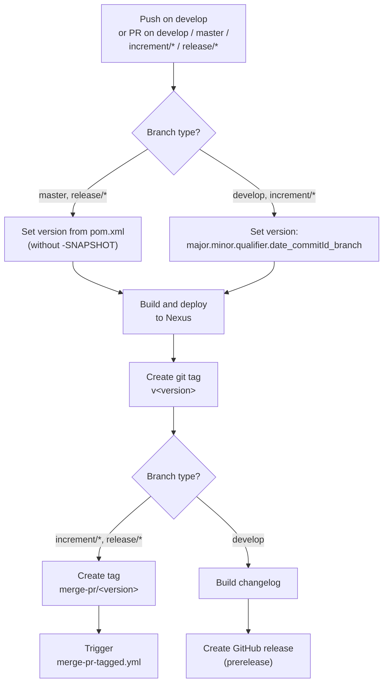
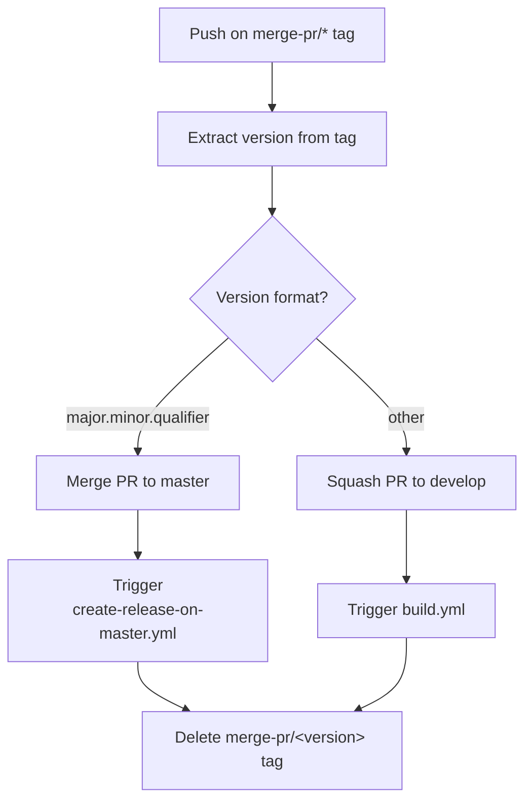
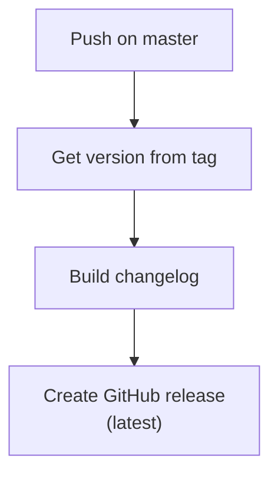
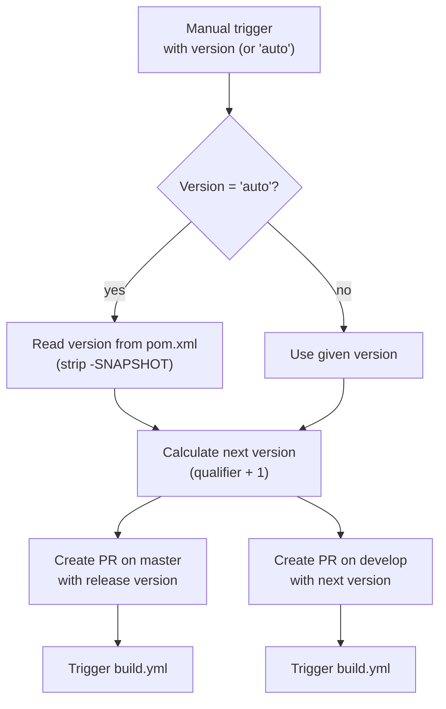
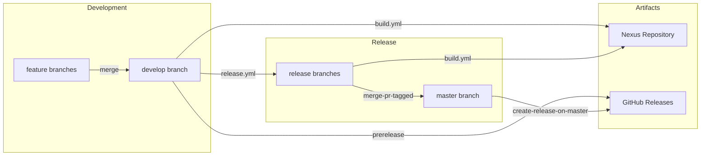

# CI/CD Flow and Branch Strategy

This document describes the Git branching model and CI/CD pipeline for the judo-meta-expression project. The versioning policy follows [GitFlow](https://www.atlassian.com/git/tutorials/comparing-workflows/gitflow-workflow).

## Branches

The project maintains several branch types, each serving a distinct purpose in the release lifecycle:

```mermaid
gitDiagram
    commit id: "init"
    branch develop
    checkout develop
    commit id: "dev-1"
    branch feature/JNG-1
    commit id: "feat-1a"
    commit id: "feat-1b"
    checkout develop
    merge feature/JNG-1
    branch feature/JNG-2
    commit id: "feat-2a"
    checkout develop
    merge feature/JNG-2
    branch release/1.0-beta1
    commit id: "rc-1"
    branch bugfix/JNG-4
    commit id: "fix-4"
    checkout release/1.0-beta1
    merge bugfix/JNG-4
    checkout master
    merge release/1.0-beta1 id: "v1.0"
    checkout develop
    merge release/1.0-beta1
```

| Branch Pattern | Base | Purpose |
|---------------|------|---------|
| `develop` | — | Main development branch; contains the latest sources for the active version |
| `feature/JNG-XXX_summary` | `develop` | New features for the active version |
| `release/X.Y-betaN` | `develop` | Release stabilization branches (the `release/` prefix is reserved for CI) |
| `bugfix/JNG-XXX_summary` | `release/*` | Bug fixes applied to release branches; must also be applied to newer release and develop branches |
| `support/JNG-XXX_summary` | `release/*` | Minor changes for a previous release; merged back to the release branch on update |
| `hotfix/JNG-XXX_summary` | `master` | Urgent fixes applied to both release and master branches |
| `master` | — | Latest released production sources |

> **Important:** There is no commit without a JIRA ticket number. Every commit and pull request must include `JNG-XXX`.

## Version Numbers

Versions follow semantic versioning with these rules:

| Event | Version Action |
|-------|---------------|
| Start a `feature/` branch | No version change |
| Start a `release/` branch from `develop` | Increment 2nd number on `develop` |
| Start a `bugfix/` branch | No version change (applied during release testing) |
| Start a `support/` branch | Increment 3rd number |
| Start a `hotfix/` branch | Increment 4th number |

## GitHub Actions Workflows

### build.yml — Main Build Pipeline

This is the primary workflow, triggered on pushes to `develop` and pull requests targeting `develop`, `master`, `increment/*`, or `release/*`.



### merge-pr-tagged.yml — PR Merge Automation

Triggered when a `merge-pr/*` tag is pushed. Routes the merge based on version format:



### create-release-on-master.yml — Production Release

Triggered on pushes to `master`. Creates the final GitHub release with a generated changelog.



### release.yml — Manual Release Trigger

Manually triggered with a version parameter. Creates pull requests for both the release and the next development version:



### Other Workflows

| Workflow | Purpose |
|----------|---------|
| `build-dependabot.yml` | Separate build pipeline for Dependabot PRs |
| `bump-version.yml` | Automated version bumping |
| `delete-old-draft-releases.yml` | Cleanup stale draft releases |
| `jira-description-to-pr.yml` | Copies JIRA issue description into PR body |
| `sync-labels.yml` | Synchronizes GitHub labels |

## Overall CI/CD Flow



## Development Workflow

For issue tracking, the project uses [JIRA](https://blackbelt.atlassian.net/jira/dashboards).

1. Pick a JIRA ticket (e.g. `JNG-1234`)
2. Create a feature branch: `feature/JNG-1234_short_description`
3. Develop and commit (every commit references the ticket)
4. Push and create a PR targeting `develop`
5. CI builds and deploys a snapshot to Nexus
6. On merge, a prerelease is created on GitHub
