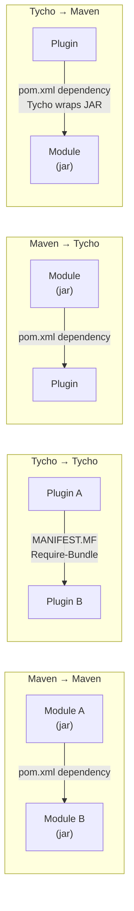

# Contributing to JUDO Expression Metamodel

This guide covers everything you need to contribute to the judo-meta-expression project — whether you're a human developer or an LLM assistant.

## Environment Setup

### Prerequisites

| Tool | Minimum Version | Check Command |
|------|----------------|---------------|
| JDK | 21 | `java -version` |
| Maven | 3.9.9 | `mvn -v` |

> **Tip:** This project uses [SdkMan](https://sdkman.io/) for Java version management. Run `PAGER=cat sdk list java` to see available versions, then `sdk use java 21.x.y-zulu` to switch.

### Build Verification

```bash
mvn clean install
```

The build is successful when:
- The log ends with `[INFO] BUILD SUCCESS`
- There are no `[ERROR]` lines in the output
- All artifacts are present in their respective `target/` directories

## Project Structure

This is a hybrid Maven/Tycho project. Modules fall into three categories:

### Eclipse Plugin Modules (Tycho)

These use `eclipse-plugin` or `eclipse-feature` packaging and are managed by Tycho:

| Module | Purpose |
|--------|---------|
| `model/` | Core EMF metamodel — contains `expression.ecore`, generated Java classes, runtime utilities, and EVL validations |
| `adapter-measure/` | Measure/unit resolution adapter for numeric and temporal expressions |
| `builder-jql/` | JQL-to-Expression transformer with 55+ function transformers |
| `feature-model/` | Eclipse feature for the core model |
| `feature-adapter-measure/` | Eclipse feature for the measure adapter |
| `feature-builder-jql/` | Eclipse feature for the JQL builder |
| `site/` | P2 update site aggregating all features |

### Standard Maven Modules

| Module | Purpose |
|--------|---------|
| `model-test/` | JUnit 5 unit tests for the model and adapters |
| `osgi/` | Standalone OSGi bundle with dynamic model loading via `ExpressionModelBundleTracker` |
| `osgi-itest/` | OSGi integration tests running on Apache Karaf via PAX Exam |

### Dependency Rules

Because this project mixes Tycho and plain Maven modules, dependency management follows specific rules:



| Scenario | Where to Declare |
|----------|-----------------|
| Maven module depends on Maven module | `<dependency>` in consumer's `pom.xml` |
| Tycho plugin depends on Tycho plugin | `Require-Bundle` in consumer's `META-INF/MANIFEST.MF` — **not** in `pom.xml` |
| Maven module depends on Tycho plugin | `<dependency>` in consumer's `pom.xml` |
| Tycho plugin depends on Maven JAR | `<dependency>` in plugin's `pom.xml` (Tycho wraps it as OSGi bundle) |

## Code Generation

The EMF model classes are generated from `model/model/expression.ecore` via an MWE2 workflow located at `model/src/workflow/`. Generated code goes into `model/src-gen/`.

> **Warning:** Never edit files in `src-gen/` directories — they are regenerated on every build and your changes will be lost.

### Running Code Generation in Eclipse

Run the MWE2 Workflow: `hu.blackbelt.judo.meta.asm.model project src/workflow/generateModel.mwe2`

Required Eclipse plugins: XTend, XText, MWE, MWE2, Epsilon, Modeling Tools, m2e.

## Version Policy

Maven and Eclipse handle versions differently:

| System | Snapshot Notation | Example |
|--------|------------------|---------|
| Maven | `-SNAPSHOT` suffix | `1.0.0-SNAPSHOT` |
| Eclipse/OSGi | `.qualifier` suffix | `1.0.0.qualifier` |

The Tycho Versions Plugin reconciles these by replacing qualifiers and Maven versions with a technical version number during each build.

To update site category versions:

```bash
mvn clean install -P update-category-versions -f site/pom.xml
```

## Coding Guidelines

### Style

- **Indentation**: 4 spaces (no tabs)
- **Naming**: PascalCase for classes/enums/interfaces, camelCase for methods/variables, UPPER_SNAKE_CASE for constants
- **Braces**: Opening `{` on the same line as the statement
- **JavaDoc**: Required on all public classes and methods — include `@param`, `@return` as applicable

### Testing

- All new public methods must have JUnit 5 tests
- Bug fixes must include a regression test (fails before fix, passes after)
- Test classes go in `src/test/java/` and are named `[ClassName]Test.java`

## Commands

```bash
# Full build
mvn clean install

# Run tests only
mvn clean test

# Run a single test class
mvn test -pl model-test -Dtest=ExpressionValidatorTest

# Full verification (includes OSGi integration tests)
mvn verify
```

## Submission Guidelines

### Issues

Before submitting an issue, search the [issue tracker](https://github.com/BlackBeltTechnology/judo-meta-expression/issues) first. When filing, include:
- Output of `java -version` and `mvn -version`
- Relevant `pom.xml` or `.flattened-pom.xml`
- A minimal reproduction case

### Pull Requests

This project follows [GitHub's standard forking model](https://guides.github.com/activities/forking/). Fork the project and submit pull requests.

Use [Conventional Commits](https://www.conventionalcommits.org/) for commit messages:

```
feat: add temporal expression duration support

Adds duration calculation for timestamp difference expressions,
including measure-aware unit resolution.

Refs: #JNG-1234
```

Prefixes: `feat:`, `fix:`, `docs:`, `style:`, `refactor:`, `test:`

## Troubleshooting

### JUnit Tests in Eclipse

Eclipse + Tycho has a classpath issue where JUnit is not included. The workaround is a `Required-Bundle` entry in the OSGi Manifest. See [Eclipse Bug 534587](https://bugs.eclipse.org/bugs/show_bug.cgi?id=534587).

### Lombok

Tycho does not support Lombok generation directly ([lombok#285](https://github.com/rzwitserloot/lombok/issues/285)). No Lombok is used in Eclipse plugin modules — all source code there is generated.

### Tycho Repository References

All referenced plugin sites must be added manually to site definitions. See [Eclipse Bug 453708](https://bugs.eclipse.org/bugs/show_bug.cgi?id=453708).

## LLM Contribution Scope

**Allowed**: Refactor code, add methods, fix documented bugs, write tests, update JavaDoc.

**Requires explicit human approval**:
- Changes to build configuration (`pom.xml`, `feature.xml`, `site.xml`, `MANIFEST.MF`)
- Changes to files in `src-gen/` directories
- Changes to CI/CD workflows (`.github/workflows/`)
