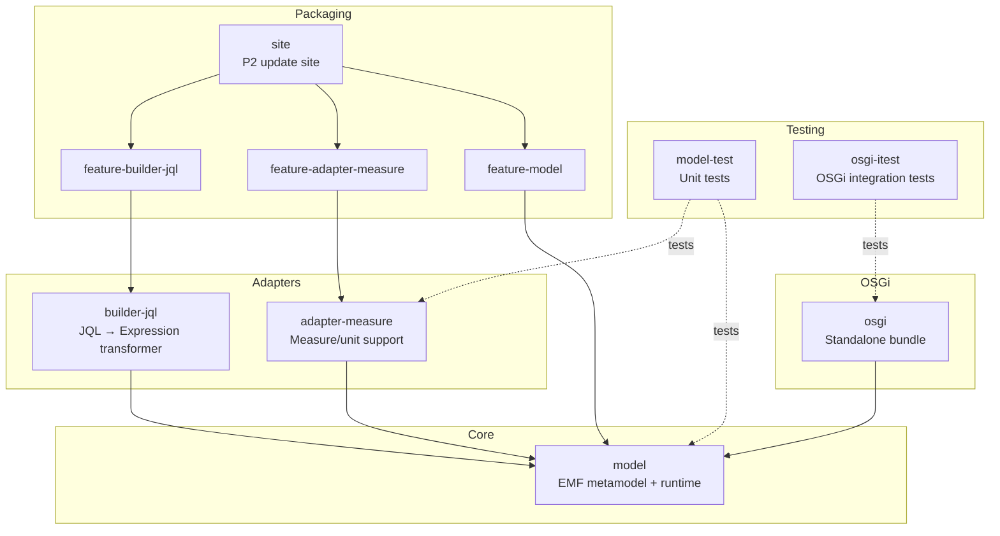
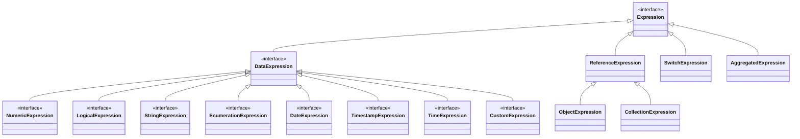

# JUDO Expression Metamodel

[](https://github.com/BlackBeltTechnology/judo-meta-expression/actions/workflows/build.yml)

## Introduction

The JUDO Expression Metamodel defines a type-safe, model-driven representation for expressions within the [JUDO Community](https://github.com/BlackBeltTechnology/judo-community) ecosystem. It covers numeric, string, logical, temporal, collection, enumeration, and custom expression types — providing the foundation for expression building, validation, and evaluation across the JUDO framework.

This module is consumed by downstream adapters (e.g. `judo-meta-expression-asm`) that transform expression models into target-platform representations.

The project is dual-packaged: it works as an **Eclipse plugin** (with features and update sites) and as a **standalone OSGi bundle** (without Eclipse).

## Module Overview



| Module | Type | Description |
|--------|------|-------------|
| `model/` | eclipse-plugin | Core EMF metamodel (`expression.ecore`), generated Java classes, runtime utilities, and Epsilon EVL validations |
| `adapter-measure/` | eclipse-plugin | Measure and unit resolution adapter — dimension calculation, unit conversion, duration support |
| `builder-jql/` | eclipse-plugin | Transforms JQL (JUDO Query Language) expressions into Expression metamodel instances |
| `model-test/` | jar | JUnit 5 tests for the core model and adapters |
| `osgi/` | bundle | Standalone OSGi bundle with bundle tracker for dynamic model loading |
| `osgi-itest/` | jar | OSGi integration tests using PAX Exam on Apache Karaf |
| `feature-model/` | eclipse-feature | Eclipse feature packaging for the core model |
| `feature-adapter-measure/` | eclipse-feature | Eclipse feature packaging for the measure adapter |
| `feature-builder-jql/` | eclipse-feature | Eclipse feature packaging for the JQL builder |
| `site/` | eclipse-repository | P2 update site aggregating all features |

## Expression Type Hierarchy

The metamodel defines a rich type hierarchy for expressions:



## Quick Start

### Prerequisites

- **JDK 21** or higher (`java -version`)
- **Maven 3.9.9** or higher (`mvn -v`)

> **Tip:** Use [SdkMan](https://sdkman.io/) to manage Java versions: `sdk use java 21.x.y-zulu`

### Build

```bash
mvn clean install
```

### Run Tests

```bash
# Unit tests only
mvn test

# Full verification including OSGi integration tests
mvn verify
```

## Context

This project is a building block of the [judo-community](https://github.com/BlackBeltTechnology/judo-community) aggregator project. See the corresponding documentation for how this module fits into the broader ecosystem.

## Contributing

See [CONTRIBUTING.md](CONTRIBUTING.md) for environment setup, code structure, coding guidelines, and submission instructions.

## License

This project is licensed under the [Eclipse Public License - v 2.0](https://www.eclipse.org/legal/epl-2.0/).
